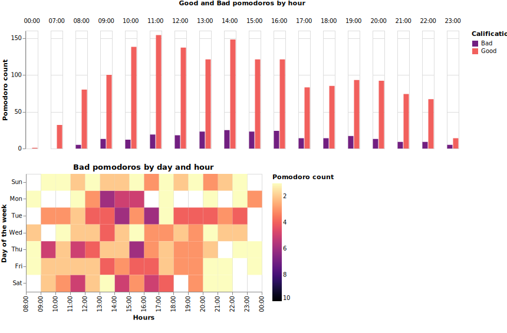
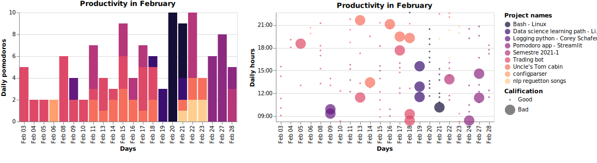
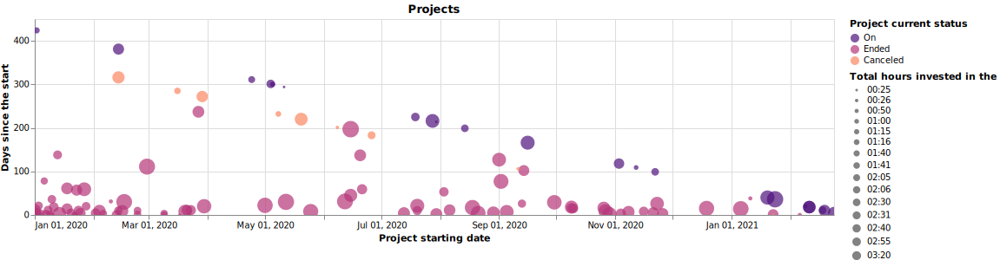

# Learning with Pomodoros and Recalls

Inspired by the wonderful Coursera course [Learning how to learn](https://www.coursera.org/learn/learning-how-to-learn).
I wanted to create an app with two concepts that I found interesting "Pomodoros and Recalls." Thus, I created this app that combines both techniques.

The app has had different versions since the beginning. I first created a console app where you can create pomodoros, and the code of this version can be found inside the `console` folder and we use the `app.py` to run it.

Then, I decided to create a UI for the app where I could also add recalls, so I learned a little bit of PyQT5 which allowed me to create an app that enables the creation of pomodoros and recalls.

Finally, I wanted to see a dashboard and have the ability to search and show my recalls, therefore, I created the final version of this idea. I chose to do it using `Streamlit` because I work with data and is a tool that I already knew.

The app is not completed yet, but I feel pretty good with the current result knowing some of the limitations that `Streamlit` has to build the interface.

## NOTE:

The app has been designed as a personal app, that is why we need to run it locally and maybe in the future I make it available online.

### Install
```console
git clone https://github.com/JonathanElejalde/pomodoro.git
pip install -r requirements.txt
```

### Run
```console
streamlit run web_app.py
```

### Creating firts pomodoro

These are the steps to start your firts pomodoro:

1. Create a new category. Here you can add the projects whitin that category.
2. Create a new project.
3. Hit the `Start Pomodoro`. This will start a 25 min pomodoro, it will end with a `countdown` sound.
    - Then 5 min of resting will start and these will end with a `tada` sound.
4. Once the pomodoro ends, you have the opportunity to grade your pomodoro, it can be either `Good` or `Bad` then just push the `Send Calification` button. This is going to be useful to the `Dashboard` where you can find your study patterns. 
5. Finally, If you want to end or cancel a project, enable the process by clicking the `Enable to End/Cancel [PROJECT NAME]` checkbox.

### Adding recalls

To create a recall, you need to add:

* A project name
* A recall title
* Recall text

Finally, to save it into the database hit the `Add Recall` button.

##### Note: 

All these are necessary to retrieve the recalls by project name, and for searching specific information inside a recall.

### Other functionalities

The other functionalities like `Searching` and `Dashboard` you need to enable them by hitting the corresponding the checkbox.


## Built With

- The interface was created using `Streamlit`
- The funcionality was created using python and libraries like `numpy, pandas`
- Finally, the dashboard was created using `Altair`


### Dashboard Example

This is how the dashboard could look with a little bit of information



